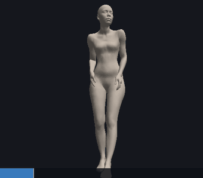

# ARFPlayer

A small, dependency-light **reader, writer and player for MPEG ARF avatar
containers** (`.arfz`).

`libarf` is a clean C99 core — ZIP, JSON, tensors, animation units, hierarchy
composition and linear blend skinning — depending on nothing but libzip and
libm. `arfplay` is an OpenGL viewer on top of it, and there are Python (ctypes)
and C++ bindings that wrap the same C API without copying anything.



**[github.com/AmmarkoV/ARFPlayer](https://github.com/AmmarkoV/ARFPlayer)** ·
[sample containers](https://github.com/AmmarkoV/ARFPlayer/tree/main/samples)

> **Where do `.arfz` files come from?** Convert a video or a live webcam to ARF
> with **[SAM3DBody-cpp](https://github.com/AmmarkoV/SAM3DBody-cpp)** — run it
> with `--arf out.arfz` and it writes one container per tracked person.
> **That project's writer has not yet been updated to the numeric-id shape
> below**, so its current output will not load here until it is — see
> [doc/CONFORMANCE_GAPS.md](doc/CONFORMANCE_GAPS.md).

## ⚠ Not yet a fully conformant ARF implementation

`arf.json`'s component graph — numeric ids resolved by matching value, not
array position; `structure` as Asset/LOD; `LandmarkSet`;
`TextureSet`/`TextureTarget` — and the AAU animation-stream bitstream (field
widths, big-endian byte order, `AAU_LANDMARK`) have been checked against the
FDIS-stage text of ISO/IEC 23090-39 and match it. Still this project's own
convention rather than verified spec values:

* the sparse skin-weight tensor (the spec only defines a dense one),
* raw dense tensors in place of embedded GLB blendshape targets.

Everything this library assumes about the bytes is written down in one place,
[`src/libarf/arf_format.h`](src/libarf/arf_format.h), so there is a single file
to diff when the format moves. The full accounting of what changed and what's
still open is [doc/CONFORMANCE_GAPS.md](doc/CONFORMANCE_GAPS.md); do not treat
this README as a conformance reference on its own.

The format is ISO/IEC 23090-39 (MPEG-I Part 39). The design is based on:
J. Regateiro, A. Trioux, Q. Avril, *The MPEG Avatar Representation Format
(ARF)*, IEEE CG&A 2026 — <https://ieeexplore.ieee.org/document/11667221>.

## Building

`libarf` needs a C99 compiler, CMake and **libzip**. The player additionally
needs OpenGL, GLEW and X11; without them the library still builds and `arfplay`
is skipped.

```bash
sudo apt install build-essential cmake libzip-dev libglew-dev libgl1-mesa-dev libx11-dev
cmake -S . -B build
cmake --build build -j
```

On Fedora that is `libzip-devel`, on macOS `brew install libzip`.

No source is vendored and nothing is fetched at build time — the JSON parser is
part of the library, and everything else is a system package.

## The sample

**[`samples/summerlove_0.arfz`](samples/summerlove_0.arfz)** is committed so the
player is testable straight after a build, with no ML stack and nothing to
download. Every command in this README uses it.

| | |
|---|---|
| skeleton | 127 joints, root `body_world` |
| mesh | 18 439 vertices, 36 874 triangles, 51 337 sparse skin weights |
| animation | 551 frames at 30 fps — 18.37 s of a dance clip |
| face track | none (a `--dev-face` container adds ~16 MB of blendshape deltas) |
| size | 2.6 MB |

```bash
./build/arfplay --info samples/summerlove_0.arfz
```

It is one tracked person out of `summerlove.mp4` in
[SAM3DBody-cpp](https://github.com/AmmarkoV/SAM3DBody-cpp), exported with
`--arf`. More containers land in
[`samples/`](https://github.com/AmmarkoV/ARFPlayer/tree/main/samples) as they
are made, and the browser player offers them as one-click loads. This export is clean — `--info` reports no glitch frames and the
skeleton never exceeds 37°/frame — so it plays through without any repair. See
[Glitch frames](#glitch-frames) for the failure mode earlier exports had.

## Using the player

```bash
./build/arfplay samples/summerlove_0.arfz
```

| | |
|---|---|
| `space` | play / pause |
| `left`, `right` | step one frame |
| `home`, `end` | first / last frame |
| `l` | toggle looping |
| `[`, `]` | halve / double the playback speed |
| `r` | reset the camera |
| `escape` | quit |
| left drag | orbit |
| middle or right drag | pan |
| wheel | zoom |
| drag the bottom strip | scrub the timeline |

Non-interactive modes:

```bash
./build/arfplay --info       samples/summerlove_0.arfz   # summary
./build/arfplay --export-obj rest.obj  samples/summerlove_0.arfz
./build/arfplay --export-obj f100.obj --frame 100 samples/summerlove_0.arfz
./build/arfplay --save copy.arfz samples/summerlove_0.arfz   # re-encode, for round trip checks
./build/arfplay --help
```

## Glitch frames

Containers carry raw tracking output, and that output has a recurring failure
mode worth knowing about before you conclude a player is broken.

The pose estimator regresses each joint's local rotation as **Euler angles**
from a linear PCA decode, then converts to a quaternion. A joint sitting near
that representation's singularity can jump branches. The pelvis sits there for
whole clips at a time — its local rotation is a near-180° turn away from its
rest prerotation — so every so often two or three frames come out about 100°
off the smooth trajectory. One joint, a couple of frames, and because
everything hangs off the pelvis **the whole body folds over sideways**.

An earlier export of this very clip had 16 such frames out of 551, all in the
first 1.5 seconds, and the body folded flat on each of them — the mesh dropped
from 165 cm tall to as little as 50 cm. They are not detectable as bad data:
the matrices are orthogonal, unit determinant, correctly framed. Only their
velocity gives them away, at up to 155°/frame against a 1.8°/frame mean.

**The container committed here is a later, clean export**: no joint exceeds
37°/frame, `--info` reports zero glitch frames, and `--despike` has nothing to
do. The repair stays in the library because the failure mode belongs to the
format's producer rather than to any one file, and an older container or a
different clip may still carry it.

`arfDespikeFrames()` flags frames whose largest per-joint angular velocity
exceeds a threshold (40°/frame by default) and rebuilds them by slerp/lerp from
the nearest clean frames either side, then refines the flagged set so that real
motion caught between two nearby glitches is given back rather than
interpolated away. On the earlier export of this clip it rewrote 16 frames and
left the other 97% untouched.

This mirrors the two-stage despike in the producing project's GMR retargeting
path (`tools/gmr_retarget.py`, `despike_frames`), which exists for the same
glitches and defaults to the same threshold. That filter lives *downstream* of
the container, so a `.arfz` still carries the raw frames and every reader meets
them.

Because it rewrites the animation, it is **never applied automatically**:

```bash
./build/arfplay sample.arfz                  # viewing: repaired by default
./build/arfplay --no-despike sample.arfz     # viewing: exactly as recorded
./build/arfplay --despike=25 sample.arfz     # stricter threshold
./build/arfplay --info sample.arfz           # reports the count, changes nothing
./build/arfplay --save out.arfz sample.arfz            # writes the recorded track
./build/arfplay --save out.arfz --despike sample.arfz   # writes the repaired track
```

`--info`, `--save` and `--export-obj` leave the data alone unless `--despike`
is passed, so re-encoding stays byte-for-byte faithful by default.

From the bindings:

```python
avatar = Avatar.load("sample.arfz")
print(avatar.despike(), "frames repaired")     # or avatar.despike(25.0)
```

```cpp
unsigned int repaired = avatar.despike();      // or avatar.despike(25.0f)
```

## In a browser

`web/` is a second, independent player: the same container reading and the same
skinning in plain JavaScript, drawn with WebGL2. **No dependencies at all** —
the ZIP is unpacked with the platform's own `DecompressionStream`, so there is
no inflate library, no JSZip, no three.js. Three files, about 45 KB.

```bash
python3 -m http.server        # from the repository root
# then open http://localhost:8000/web/
```

The page carries one-click buttons for every container in
[`samples/`](https://github.com/AmmarkoV/ARFPlayer/tree/main/samples). Each is
fetched from beside the page first, so a local checkout serves its own copy and
works offline, and falls back to the repository — GitHub serves raw files with
an open CORS policy, so the buttons work wherever the page is hosted. `?url=`
points it at any other container.

Opening `web/index.html` straight off the filesystem works too, but both
fetches are blocked there, so drag a `.arfz` onto the page or use *open*.

Same controls as the desktop player: drag to orbit, right-drag to pan, wheel to
zoom, space to play, arrows to step, `r` to reset the camera, and the timeline
scrubs.

Verified against the C library on the sample: identical joint count, vertex
count, mesh bounding box, weight sums, frame count, root path and posed
bounding box, and it rejects all nine of `tools/mutate_arf.py`'s broken
containers with the same diagnoses.

Needs `DecompressionStream('deflate-raw')` and WebGL2 — Chrome 80+, Firefox
113+, Safari 16.4+. It has no despike; that lives in the C library.

## Using the library

### C

```c
#include "arf.h"

struct arfAvatar *avatar = arfLoad("person_0.arfz");
if (avatar==0) { fprintf(stderr,"%s\n",arfLastError()); return 1; }

struct arfPose *pose = arfPoseAllocate(avatar);
for (unsigned int frame=0; frame<avatar->numberOfFrames; frame++)
{
    arfPoseEvaluate(avatar,pose,frame);
    draw(pose->positions,pose->normals,avatar->mesh.indices);
}

arfPoseFree(pose);
arfFree(avatar);
```

The whole API is in [`src/libarf/arf.h`](src/libarf/arf.h).

### Python

`bindings/python/arf.py` loads `libarf.so` through ctypes and hands back
zero-copy views — numpy arrays when numpy is installed, `memoryview`s when it
is not. numpy is never required.

```python
import sys; sys.path.insert(0, "bindings/python")
from arf import Avatar

with Avatar.load("samples/summerlove_0.arfz") as avatar:
    print(avatar)                       # <Avatar 'person_0' 127 joints, 18439 vertices, ...>

    pose = avatar.pose()
    pose.evaluate(100)
    print(pose.positions.shape)         # (18439, 3)
```

Set `ARF_LIBRARY` if the shared object is not in `build/`. Running the module
directly (`python3 bindings/python/arf.py file.arfz`) prints the same summary
as `arfplay --info`.

### C++

`bindings/cpp/arf.hpp` is header-only: RAII ownership, exceptions instead of
return codes, non-owning spans over the library's arrays.

```cpp
#include "arf.hpp"

arf::Avatar avatar = arf::Avatar::load("person_0.arfz");
arf::Pose   pose   = avatar.pose();

pose.evaluate(100);
for (float x : pose.positions()) { /* ... */ }
```

See [`examples/arfinfo.cpp`](examples/arfinfo.cpp), built as `arfinfo_cpp`.

### Writing

The library is symmetric: build an avatar and save it.

```c
struct arfAvatar *avatar = arfCreate(nodes,vertices,triangles,weights);
arfSetNode(avatar,0,"root",-1,translation,rotation);
/* fill avatar->mesh, avatar->skin ... */
arfAppendFrame(avatar,frameIndex,localMatrices);
arfSave(avatar,"out.arfz");
```

Re-encoding the sample reproduces every binary payload **byte for byte**; only
`arf.json`'s whitespace differs.

## Conventions that will bite you

These are the ones that silently produce a wrong-looking avatar rather than an
error.

1. **Matrices are row-major with the translation in the last column**
   (`m[3]`, `m[7]`, `m[11]`). OpenGL wants the transpose — pass `GL_TRUE` to
   `glUniformMatrix4fv`, or use `arfTranspose4x4()`.
2. **A frame's local matrix is the complete local transform.** Do not also
   apply the node's rest `translation`/`rotation` when animating; those exist
   for drawing the rest pose and for tooling.
3. **Units are centimetres.**
4. **Rest rotations are XYZW quaternions**, not WXYZ.
5. **+Y is up, the avatar sits at positive Z — and it faces +Z too.** That last
   part is not what "camera-space" suggests, so it is worth measuring rather
   than assuming: the head-to-eyes vector averages +0.58 in Z over the sample
   clip. A viewer therefore wants its eye on the **+Z** side looking back
   toward -Z; put it on the -Z side and you are filming the avatar's back. The
   pipeline renderer negates Y and Z to get a camera-facing view because it
   draws with a fixed camera; a `lookAt` on the correct side expresses the same
   view, so this player needs no coordinate flip at all.
6. **Padded frames are normal.** When the tracker loses a person the writer
   repeats the last pose to keep timestamps contiguous, so a clip can hold
   still for a stretch.
7. **Unknown AAU types must be skipped, not rejected.** `unit_length` exists so
   a reader can step over what it does not understand; that is the format's
   only forward-compatibility hook, and this reader honours it.
8. **Some frames are simply wrong.** Euler-singularity bursts fold the body
   over for two or three frames at a time — see [Glitch frames](#glitch-frames).
   A faithful reader shows them; `arfDespikeFrames()` repairs them.

## Verifying

`tools/validate_arf.py` is the reference reader from SAM3DBody-cpp, carried
here unchanged. It validates the **original** SAM3DBody-flavoured shape
(string component ids, `structure.animationStreams`) and no longer matches
what this library itself reads or writes since the numeric-id rewrite — see
[doc/CONFORMANCE_GAPS.md](doc/CONFORMANCE_GAPS.md). It stays useful as a
record of what that project's writer emits today, not as this library's own
oracle; `arfplay --info` / `--save` round trips are the check that matters
now (see [Using the player](#using-the-player) above).

`tools/mutate_arf.py` builds broken containers out of a good one — truncated
ZIP, malformed JSON, a missing top-level key, a `byteLength` that disagrees
with the payload, a dangling data reference, a reordered skeleton, an empty and
a truncated animation stream, and an unknown AAU type that must still load —
and checks the reader rejects each with a clear message and never crashes.

```bash
python3 tools/mutate_arf.py samples/summerlove_0.arfz ./build/arfplay
```

## Layout

```
src/libarf/        the C core: arf.h is the whole public API
  arf_format.h       the on-the-wire byte layouts, the one file to diff on drift
  arf_json.{c,h}     a small recursive-descent JSON reader
  arf_bytes.h        bounds-checked little-endian cursor and output buffer
  arf_reader.c       ZIP, JSON schema walk, tensors, AAU decoding
  arf_writer.c       tensor and AAU encoding, arf.json emit, ZIP assembly
  arf_skin.c         hierarchy compose, blendshapes, LBS, normals
  arf_despike.c      glitch-frame detection and interpolation repair
src/player/        the viewer
  arf_window.{c,h}   minimal GLX/X11 window, the only platform-specific file
  arf_camera.h       header-only orbit camera
  arf_render.{c,h}   OpenGL 3.3 core mesh and overlay drawing
  arfplay.c          command line, playback clock, timeline
bindings/          python/arf.py (ctypes) and cpp/arf.hpp (header-only)
web/               a dependency-free browser player: arf.js reads, player.js draws
shaders/           the body shaders, copied unchanged from the pipeline
examples/          arfinfo.cpp (C++ binding) and write_avatar.py (Python write path)
tools/             validate_arf.py (SAM3DBody-cpp's own oracle, pre-rewrite shape) and mutate_arf.py (robustness)
samples/           summerlove_0.arfz, the committed container every example uses
```

## Not implemented

The writer emits none of these, so there is nothing to read: ISOBMFF
containers, RTP streaming, `MPEG_node_avatar` glTF scene integration,
protection/DRM, LoDs, `AnimationLink` conversion.

## See also

* **[SAM3DBody-cpp](https://github.com/AmmarkoV/SAM3DBody-cpp)** — the producer.
  Video or webcam in, `.arfz` out (`--arf`), plus BVH export and humanoid-robot
  retargeting.
* **[ARFPlayer](https://github.com/AmmarkoV/ARFPlayer)** — this project.
  [Sample containers](https://github.com/AmmarkoV/ARFPlayer/tree/main/samples).

## License

MIT — see [LICENSE](LICENSE). Derived material and linked dependencies are
listed in [NOTICE](NOTICE).
